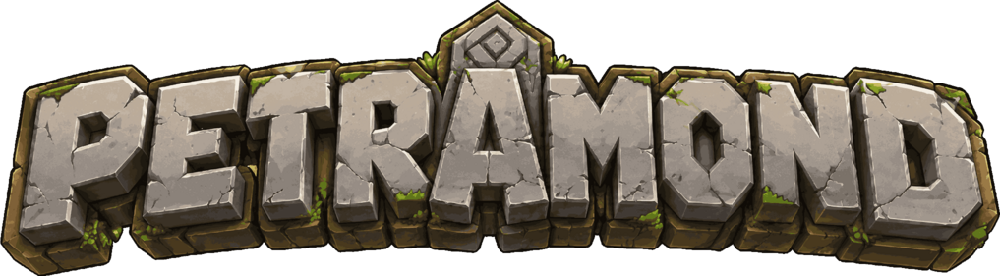

<p align="center">
  
</p>

# Petramond

A voxel sandbox about wild landscapes, player-built homes, and worlds that can
grow through mods.

<p align="center">
  <a href="https://github.com/shinyvision/petramond/releases/latest">
    
  </a>
</p>


Petramond starts with the best part of a block world: stepping over a ridge and
seeing somewhere you want to go. Its worlds are built for long views and varied
journeys, with mountains, oceans, rivers, caves, forests, wetlands, snowy peaks,
deserts, and redwood groves waiting past the next hill.

Mine what you need, craft better tools, build a shelter, place chests and
furnaces, sleep through the night, and turn a raw landscape into a place that
feels like yours.

## Play The World

- Explore wide procedural worlds with dramatic terrain, water, caves, and
  biome-to-biome variety.
- Build with familiar materials plus shape-rich blocks like stairs, slabs,
  doors, beds, glass panes, torches, and workbenches.
- Craft tools, cook resources, store supplies, gather drops, and keep your
  player alive through health, food, fall damage, and status effects.
- Meet wildlife and hostile experiments, including sample mod packs for
  zombies, kitchen ovens, and wheel blocks.
- Switch between first-person and third-person views while you build, fight, or
  just take in the world.
- Play with a mod-ready content system designed for new blocks, items, mobs,
  recipes, sounds, GUIs, and world behavior.
- There's technically multiplayer.

## Crafting recipes

Open your inventory or a crafting table to browse the recipes available there.
The list is searchable, shows ingredient icons and quantities, and disables recipes
you cannot currently afford. Select one and press **CRAFT**; crafting tables also
offer the recipes that require a table.

## Current Status

Petramond is in development. It's here for those who want to try it out, but don't expect it to be big like Minecraft.
I want the base game to be a game engine with some sandbox features, but add content packs like combat, farming and cooking through mods.
The mods will be first-class curated packs but there will also be an API to add your own content.

There is also something that looks like multiplayer that does work, but don't expect it to be amazing.

I am using AI assistance and a very strong preference about how I want the code to be architected to build this game.

## Play From Source

You need Rust stable and a desktop GPU/driver stack supported by `wgpu`.

```sh
make run
```

Useful playtest options:

```sh
SEED=0x12345678 RD=24 make run
PETRAMOND_WORLD=my-world make run
PETRAMOND_FPS=120 make run
```

To build and install the sample mods:

```sh
rustup target add wasm32-unknown-unknown
make mods
```

## Controls

- `WASD` move, mouse look, scroll wheel selects the hotbar.
- Left click mines or attacks; right click places, uses, or opens blocks.
- `Space` jumps, `Shift` sneaks, and `Ctrl` sprints.
- `E` opens inventory, `1`-`9` selects hotbar slots, and `Q` drops the held item.
- `R` rotates supported held blocks, `V` changes perspective, and `Esc` closes
  screens or pauses.

## Modding

Mods are part of the game's identity, not an afterthought. Sample packs live in
`mods-src/` and can add content such as blocks, items, mobs, recipes, sounds,
models, and custom interfaces. After `make mods`, the installed local packs live
in `mods/`.

## Source Extras

Build the game without running it:

```sh
make build
```

Open the GUI builder:

```sh
make gui-builder
```

Generate world preview images:

```sh
cargo run --quiet --bin genmap -- 42 /tmp/top.png top
cargo run --quiet --bin genfeature -- redwood /tmp/redwood.png 42 all 8
```
