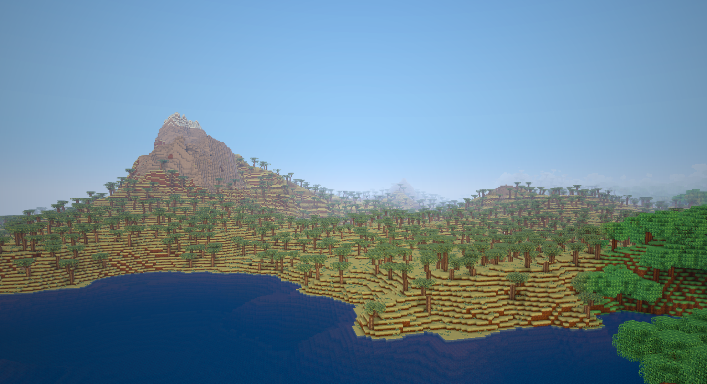

# Petramond

Petramond is a native Rust voxel game engine and sandbox world. It is built
around deterministic simulation, data-driven content, fast world streaming, and
a modding path that uses the same systems as core gameplay.



The project is currently unreleased and optimized for developer playtesting.
Expect rapid iteration, clean breaks, and no compatibility promises yet.

## What is here

- Native desktop client using `winit` and `wgpu`.
- Noise-driven terrain with biomes, caves, oceans, rivers, mountains, forests,
  vegetation features, and worldgen preview tooling.
- Cubic chunk storage and streaming with worker-side generation, lighting, and
  terrain mesh preparation.
- Data-driven blocks, items, recipes, loot tables, models, sounds, shaders, UI
  documents, and texture atlases.
- Core gameplay systems for mining, placement, water, doors, stairs, panes,
  slabs, torches, chests, furnaces, beds, health, fall damage, food, effects,
  drops, crafting, mobs, and day/night presentation.
- Renderer-owned presentation for terrain, block models, items, mobs,
  particles, outlines, sky, UI, held items, and third-person player bodies.
- Deterministic tick-side events and stage hooks for gameplay behavior.
- Mod packs with layered content catalogs plus sandboxed WASM logic through
  `mod-api`, `mod-sdk`, and sample source packs in `mods-src/`.
- `petramond-ui`, a renderer-agnostic GUI runtime, plus a standalone
  `gui-builder` editor that previews game UI documents through the same runtime.

## Repository layout

```text
assets/          Base game catalogs, textures, models, sounds, shaders, and UI docs
src/             Engine, native app, simulation, rendering, worldgen, save, net
petramond-ui/    Shared document UI runtime
gui-builder/     Standalone GUI document editor and preview tool
mod-api/         Shared host/guest ABI types for mods
mod-sdk/         Guest-side helper crate for WASM mods
mods-src/        Source workspaces for sample mods
docs/            Project notes that are safe to track
```

Generated build output lives under `target/`. Installed local mod packs live in
`mods/` after `make mods`; their source of truth is `mods-src/`.

## Requirements

- Rust stable.
- A desktop GPU/driver stack supported by `wgpu`.
- `wasm32-unknown-unknown` target when building sample mods:

```sh
rustup target add wasm32-unknown-unknown
```

## Run the game

Use the playtest profile for day-to-day work. It keeps release-grade
optimization where it matters, while preserving fast incremental rebuilds.

```sh
make run
```

Useful overrides:

```sh
SEED=0x12345678 RD=24 make run
NV_OFFLOAD= make run
PETRAMOND_WORLD=my-world make run
PETRAMOND_FPS=120 PETRAMOND_PERF=1 make run
```

The main binary is `petramond_native`:

```sh
cargo run --profile playtest --bin petramond_native
```

## Developer workflows

Build the native game:

```sh
make build
```

Run tests:

```sh
cargo test
```

Worldgen-heavy tests are opt-in:

```sh
cargo test --features worldgen-tests
```

Generate world and feature previews:

```sh
cargo run --quiet --bin genmap -- 42 /tmp/top.png top
cargo run --quiet --bin genfeature -- redwood /tmp/redwood.png 42 all 8
```

Build and install sample mods into the local `mods/` directory:

```sh
make mods
```

Run the GUI builder:

```sh
make gui-builder
```

## Architecture notes

Petramond keeps simulation and presentation deliberately separate. Gameplay
mutation belongs to deterministic tick systems on the game side; rendering,
audio, UI, and client-only feedback consume presentation snapshots and events.
World ownership stays on the owning thread, while workers compute generation,
lighting, meshing, or streaming results for the owner to apply.

Content is intended to be data first. Engine-owned rows use the `petramond:`
namespace, and mod rows use their own `mod_id:name` namespace. Save data stores
name-addressed palettes so dynamic registry ids can be assigned at load time
without making saves depend on runtime numeric ids.

Mods are not a side channel. New gameplay systems are expected to prove out the
same seams that mods use: content catalogs, events, tick stages, registries, and
WASM host calls.

## Status

Petramond is private, unreleased, and in active development. The current goal is
to keep the engine clean, deterministic, moddable, and pleasant to playtest
before stabilizing any public compatibility surface.
